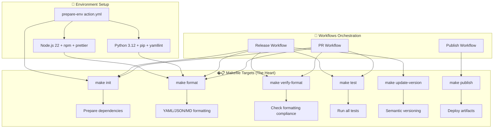
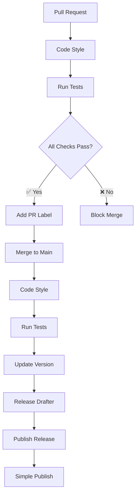
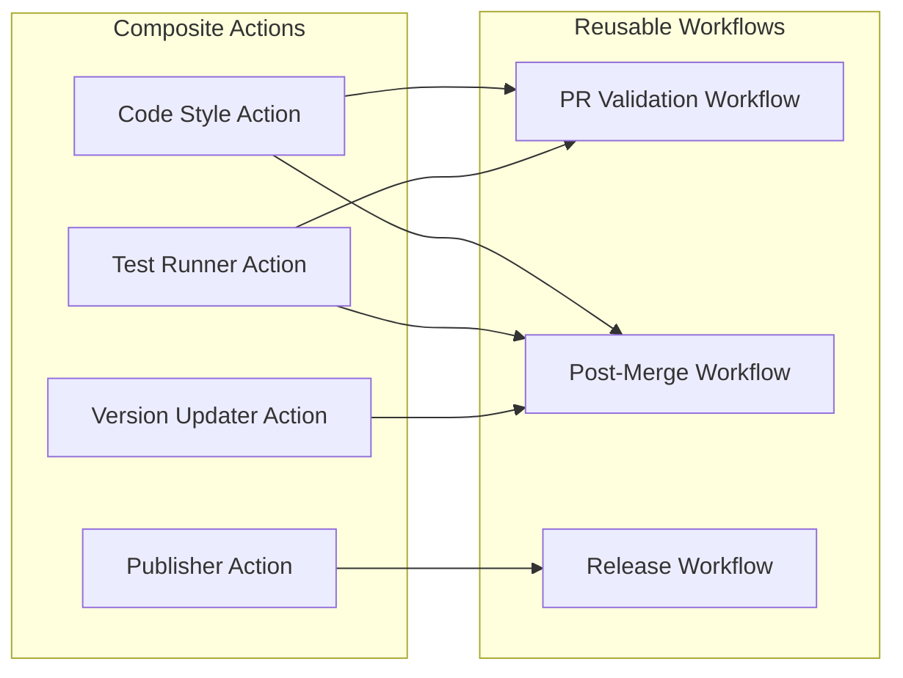
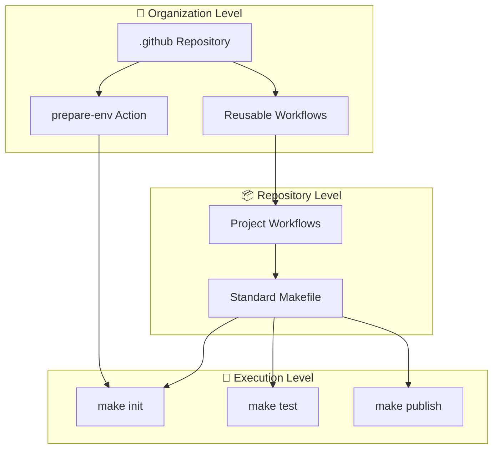

# 🚀 SINCPRO S.R.L. Shared GitHub Templates

Centralized repository of reusable workflows and composite actions that standardize the PR → merge → release lifecycle across all Sincpro repositories.

## 🎯 Core Philosophy

This repository implements the **Composite Pattern** with the **Makefile as the heart** of our standardization approach. Every repository must adopt:

1. **📋 Standard Makefile**: Defines consistent targets (`init`, `format`, `test`, `publish`, etc.)
2. **🔧 Environment Preparation Action**: `actions/prepare-env/action.yml` ensures consistent tooling
3. **🔄 Reusable Workflows**: Orchestrate the complete PR → merge → release lifecycle

> **💡 Key Principle**: The Makefile serves as the universal interface - workflows call `make` targets, ensuring technology-agnostic automation.

## � Process Flow: The Makefile as the Heart

The **Makefile is the core orchestrator** of our standardization strategy. Here's how everything connects:



### 🎯 Why the Makefile is Central

1. **🔧 Technology Agnostic**: Whether Python, Node.js, Go, or any language, `make` provides a universal interface
2. **📞 Consistent API**: All workflows call the same `make` targets regardless of project specifics
3. **🔀 Flexibility**: Each repository can customize the implementation behind `make` targets
4. **🧪 Local Development**: Developers use the same commands locally as CI/CD pipelines
5. **📊 Standardization**: Ensures uniform behavior across all Sincpro repositories

### 🔄 Three-Stage Lifecycle

#### Stage 1: Pull Request Validation

```yaml
# Workflow calls these targets:
make init          # Prepare environment
make verify-format # Check code formatting
make test         # Validate functionality
```

#### Stage 2: Merge to Main (Release Draft)

```yaml
# Workflow calls these targets:
make init          # Prepare environment
make verify-format # Ensure formatting
make test         # Confirm stability
make update-version VERSION=x.y.z  # Bump version
# → Create release draft automatically
```

#### Stage 3: Release Publication

```yaml
# Workflow calls these targets:
make init          # Prepare environment
make publish       # Deploy to registries
make deploy        # Deploy services (if applicable)
```

## 📋 Workflow Matrix

| Stage            | Trigger      | Makefile Targets                                     | Action Used      | Result              |
| ---------------- | ------------ | ---------------------------------------------------- | ---------------- | ------------------- |
| **Pull Request** | Open/Update  | `init` → `verify-format` → `test`                    | `prepare-env@v1` | Label added         |
| **Merge**        | Push to main | `init` → `verify-format` → `test` → `update-version` | `prepare-env@v1` | Draft created       |
| **Release**      | Publish      | `init` → `publish` → `deploy`                        | `prepare-env@v1` | Artifacts published |

| Stage            | Trigger      | Actions                                      | Status     | Result              |
| ---------------- | ------------ | -------------------------------------------- | ---------- | ------------------- |
| **Pull Request** | Open/Update  | Code Style + Tests                           | ✅ Pass    | Label added         |
| **Merge**        | Push to main | Code Style + Tests + Version + Release Draft | 🔄 Process | Draft created       |
| **Release**      | Publish      | Deploy/Publish                               | 🚀 Deploy  | Artifacts published |

## 🔄 Development Flow



## 🏗️ Composite Pattern Architecture



## 📦 Responsibilities Matrix

| Component           | Responsibility       | Reusable | Configurable |
| ------------------- | -------------------- | -------- | ------------ |
| **Code Style**      | Format and linting   | ✅       | ✅           |
| **Test Runner**     | Execute tests        | ✅       | ✅           |
| **PR Labeler**      | Automatic labeling   | ✅       | ✅           |
| **Version Manager** | Semantic versioning  | ✅       | ✅           |
| **Release Drafter** | Changelog generation | ✅       | ✅           |
| **Publisher**       | Deploy to registries | ✅       | ✅           |

## 🛠️ Required Implementation for All Repositories

### 1. 📋 Add Standard Makefile

Every repository **MUST** include this standardized Makefile in the root directory:

```makefile
prepare-environment:
  @echo "Install core libraries like pip, npm, etc."

init: prepare-environment
  @echo "Initialize project dependencies"

format:
  @prettier --write --tab-width 2 "**/*.{yml,yaml,json,md}"

verify-format: format
  @if ! git diff --quiet; then \
    echo >&2 "✘ Formatting modified files. Please add them to commit."; \
    git --no-pager diff --name-only HEAD -- >&2; \
    exit 1; \
  fi

test:
  @echo "Run project tests"

update-version:
ifndef VERSION
  $(error VERSION is required. Usage: make update-version VERSION=1.2.3)
endif
  @echo "Update project version $(VERSION)"

publish:
  @echo "Publish the artifact"

deploy:
  @echo "Deploy the artifact (services only)"
```

### 2. 🔧 Use Environment Preparation Action

All workflows **MUST** start with the environment preparation action:

```yaml
- name: Prepare Environment
  uses: Sincpro-SRL/.github/.github/actions/prepare-env@v1
```

This action ensures consistent tooling across all repositories:

- **Python 3.12** with pip and yamllint
- **Node.js 22** with npm and prettier
- **Verified installation** of all formatting/linting tools

### 3. 🔄 Implement Reusable Workflows

Use our standardized workflows in your `.github/workflows/`:

```yaml
# .github/workflows/pr-check.yml
name: PR Validation
on:
  pull_request:
    branches: [main]

jobs:
  check:
    uses: Sincpro-SRL/.github/.github/workflows/02-check-code.yaml@v1
    secrets: inherit

# .github/workflows/release.yml
name: Release Process
on:
  push:
    branches: [main]

jobs:
  release:
    uses: Sincpro-SRL/.github/.github/workflows/03-release_draft.yaml@v1
    secrets: inherit
```

## ✅ Best Practices for Repository Integration

### 📁 Directory Structure Requirements

```text
your-repository/
├── Makefile                 # ← REQUIRED: Standard targets
├── .github/
│   └── workflows/
│       ├── pr-check.yml     # ← Uses: 02-check-code.yaml@v1
│       ├── release.yml      # ← Uses: 03-release_draft.yaml@v1
│       └── publish.yml      # ← Uses: 04-publish-release-process.yaml@v1
├── src/                     # Your project code
└── README.md
```

### 🔧 Makefile Customization Examples

#### Python Project

```makefile
prepare-environment:
  python -m pip install --upgrade pip

init: prepare-environment
  pip install -r requirements.txt
  pip install -r requirements-dev.txt

test:
  pytest tests/ --cov=src/

publish:
  python setup.py sdist bdist_wheel
  twine upload dist/*
```

#### Node.js Project

```makefile
prepare-environment:
  npm install -g npm@latest

init: prepare-environment
  npm ci

test:
  npm test

publish:
  npm publish
```

#### Go Project

```makefile
prepare-environment:
  go version

init: prepare-environment
  go mod download

test:
  go test ./...

publish:
  goreleaser release --rm-dist
```

### 🚨 Common Issues and Solutions

| Issue                            | Cause                      | Solution                                    |
| -------------------------------- | -------------------------- | ------------------------------------------- |
| ❌ `make: command not found`     | Missing Makefile           | Add standard Makefile to repository root    |
| ❌ `prettier: command not found` | Missing prepare-env action | Add `prepare-env@v1` step before make calls |
| ❌ `VERSION is required`         | Missing version parameter  | Use `make update-version VERSION=1.2.3`     |
| ❌ Workflow permission denied    | Missing secrets            | Add `secrets: inherit` to workflow calls    |

### 🔄 Migration Checklist

- [ ] **Add Makefile** with all standard targets to repository root
- [ ] **Update workflows** to use `Sincpro-SRL/.github/.github/workflows/*@v1`
- [ ] **Add prepare-env action** to all workflow jobs
- [ ] **Configure branch protection** requiring status checks
- [ ] **Test locally** by running `make init`, `make test`, etc.
- [ ] **Verify CI/CD** pipeline executes successfully

## 🏗️ Architectural Benefits

### 🎯 Standardization Advantages

1. **🔧 Universal Interface**: All repositories use the same `make` commands
2. **🔄 Consistency**: Identical workflow execution across projects
3. **📊 Predictability**: Developers know what commands to expect
4. **🧪 Local-CI Parity**: Same commands work locally and in CI/CD
5. **🔀 Technology Agnostic**: Works with any programming language

### 📈 Scalability Features

- **🆕 New Projects**: Copy Makefile + workflows = instant CI/CD
- **🔧 Customization**: Override targets while maintaining interface
- **📦 Modularity**: Add/remove workflow stages as needed
- **🔄 Maintenance**: Central updates propagate to all repositories

### 🎨 Composite Pattern Implementation



---

**📞 Support**: Contact Sincpro engineering team for new templates, improvements, or integration assistance.

**🔗 Quick Links**:

- [Environment Action](/.github/actions/prepare-env/action.yml)
- [Workflow Templates](/.github/workflows/)
- [Standard Makefile](/Makefile)

**📝 Version**: Updated for centralized `.github` repository with `prepare-env` action requirement.
