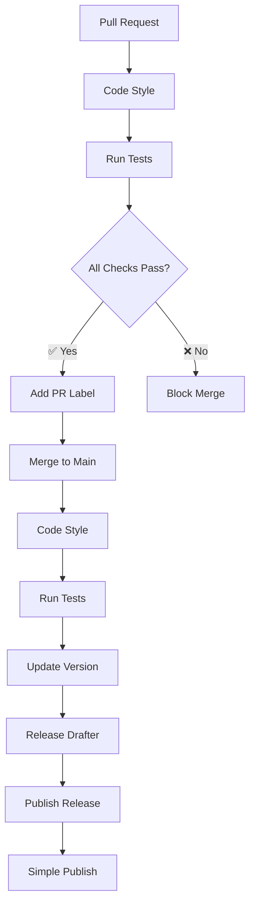
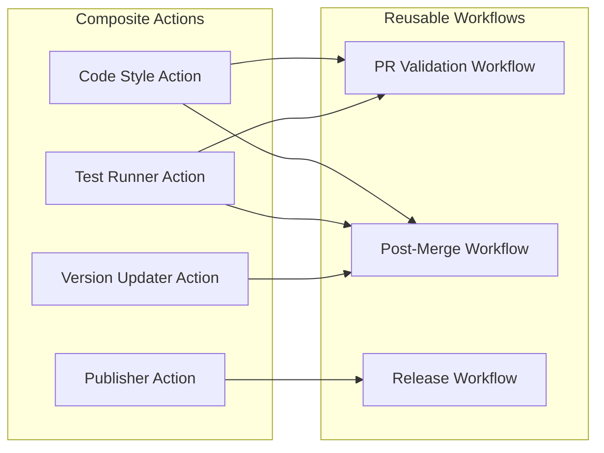

# 🚀 SINCPRO S.R.L. Shared GitHub Templates

Centralized repository of reusable workflows and composite actions that standardize the PR → merge → release lifecycle across all Sincpro repositories.

## 📋 Workflow Matrix

| Stage            | Trigger      | Actions                                      | Status     | Result              |
| ---------------- | ------------ | -------------------------------------------- | ---------- | ------------------- |
| **Pull Request** | Open/Update  | Code Style + Tests                           | ✅ Pass    | Label added         |
| **Merge**        | Push to main | Code Style + Tests + Version + Release Draft | 🔄 Process | Draft created       |
| **Release**      | Publish      | Deploy/Publish                               | 🚀 Deploy  | Artifacts published |

## 🔄 Development Flow



## 🏗️ Composite Pattern Architecture



## 📦 Responsibilities Matrix

| Component           | Responsibility       | Reusable | Configurable |
| ------------------- | -------------------- | -------- | ------------ |
| **Code Style**      | Format and linting   | ✅       | ✅           |
| **Test Runner**     | Execute tests        | ✅       | ✅           |
| **PR Labeler**      | Automatic labeling   | ✅       | ✅           |
| **Version Manager** | Semantic versioning  | ✅       | ✅           |
| **Release Drafter** | Changelog generation | ✅       | ✅           |
| **Publisher**       | Deploy to registries | ✅       | ✅           |

## 🛠️ Implementation

### Composite Action

```yaml
- uses: Sincpro-SRL/.github/.github/actions/code-style@v1
- uses: Sincpro-SRL/.github/.github/actions/test-runner@v1
```

### Reusable Workflow

```yaml
uses: Sincpro-SRL/.github/.github/workflows/pr-validation.yml@v1
secrets: inherit
```

## 📋 Patterns Matrix

| Pattern             | Purpose                | Benefit       | Implementation      |
| ------------------- | ---------------------- | ------------- | ------------------- |
| **Composite**       | Reusable steps         | DRY principle | Modular actions     |
| **Template Method** | Standard flow          | Consistency   | Base workflows      |
| **Strategy**        | Flexible configuration | Adaptability  | Input parameters    |
| **Observer**        | Notifications          | Visibility    | Labels and webhooks |

## 🤝 Contribution Matrix

| Phase           | Action        | Validation      | Outcome      |
| --------------- | ------------- | --------------- | ------------ |
| **Development** | Fork & PR     | Code review     | Approval     |
| **Integration** | Merge         | CI Pipeline     | Validation   |
| **Release**     | Tag & Publish | Automated tests | Availability |

---

**Contact**: Sincpro engineering team for new templates or improvements.
