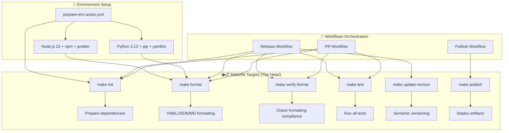
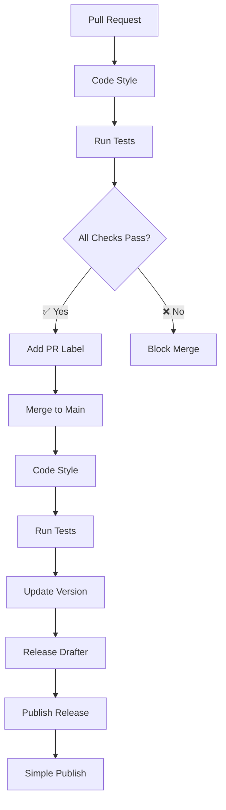
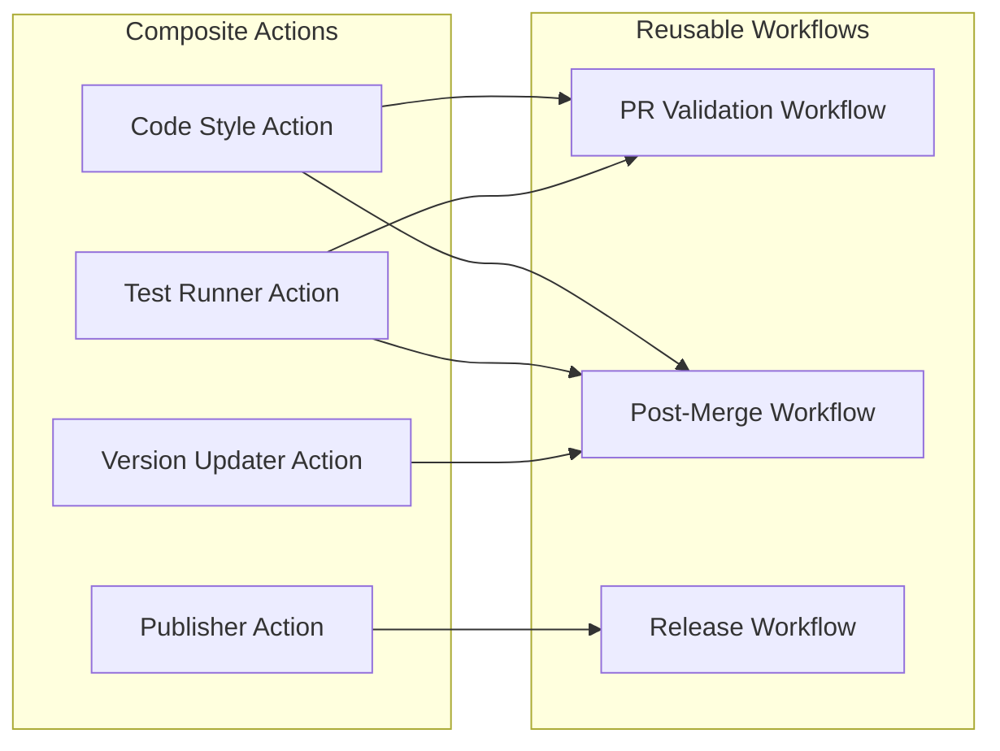
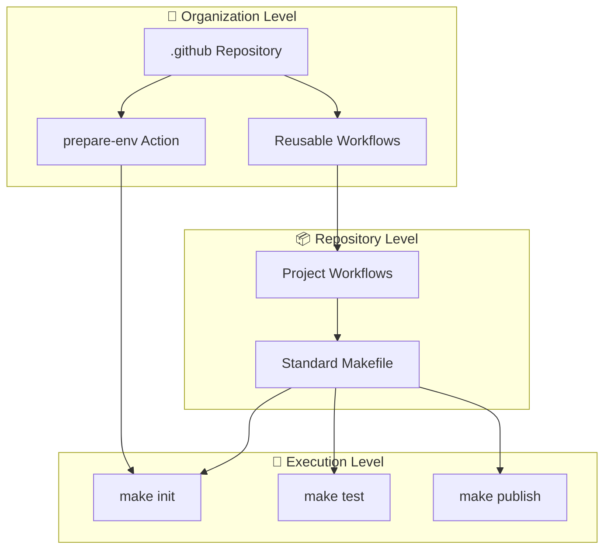

# 🚀 SINCPRO S.R.L. Shared GitHub Templates

Centralized repository of reusable workflows and composite actions that standardize the PR → merge → release lifecycle across all Sincpro repositories.

## 🎯 Core Philosophy

This repository implements the **Composite Pattern** with the **Makefile as the heart** of our standardization approach. Every repository must adopt:

1. **📋 Standard Makefile**: Defines consistent targets (`init`, `format`, `test`, `publish`, etc.)
2. **🔧 Environment Preparation Action**: `actions/prepare-env/action.yml` ensures consistent tooling
3. **🔄 Reusable Workflows**: Orchestrate the complete PR → merge → release lifecycle

> **💡 Key Principle**: The Makefile serves as the universal interface - workflows call `make` targets, ensuring technology-agnostic automation.

## � Process Flow: The Makefile as the Heart

The **Makefile is the core orchestrator** of our standardization strategy. Here's how everything connects:


```mermaid
graph TD
    subgraph "🔧 Environment Setup"
        A[prepare-env action.yml] --> B[Python 3.12 + pip + yamllint]
        A --> C[Node.js 22 + npm + prettier]
    end

    subgraph "�📋 Makefile Targets (The Heart)"
        D[make init] --> E[Prepare dependencies]
        F[make format] --> G[YAML/JSON/MD formatting]
        H[make verify-format] --> I[Check formatting compliance]
        J[make test] --> K[Run all tests]
        L[make update-version] --> M[Semantic versioning]
        N[make publish] --> O[Deploy artifacts]
    end

    subgraph "🔄 Workflows Orchestration"
        P[PR Workflow] --> D
        P --> F
        P --> H
        P --> J
        Q[Release Workflow] --> D
        Q --> F
        Q --> H
        Q --> J
        Q --> L
        R[Publish Workflow] --> N
    end

    A --> D
    B --> F
    C --> F
```

### 🎯 Why the Makefile is Central

1. **🔧 Technology Agnostic**: Whether Python, Node.js, Go, or any language, `make` provides a universal interface
2. **📞 Consistent API**: All workflows call the same `make` targets regardless of project specifics
3. **🔀 Flexibility**: Each repository can customize the implementation behind `make` targets
4. **🧪 Local Development**: Developers use the same commands locally as CI/CD pipelines
5. **📊 Standardization**: Ensures uniform behavior across all Sincpro repositories

### 🔄 Three-Stage Lifecycle

#### Stage 1: Pull Request Validation

```yaml
# Workflow calls these targets:
make init          # Prepare environment
make verify-format # Check code formatting
make test         # Validate functionality
```

#### Stage 2: Merge to Main (Release Draft)

```yaml
# Workflow calls these targets:
make init          # Prepare environment
make verify-format # Ensure formatting
make test         # Confirm stability
make update-version VERSION=x.y.z  # Bump version
# → Create release draft automatically
```

#### Stage 3: Release Publication

```yaml
# Workflow calls these targets:
make init          # Prepare environment
make publish       # Deploy to registries
make deploy        # Deploy services (if applicable)
```

## 📋 Workflow Matrix

| Stage            | Trigger      | Makefile Targets                                     | Action Used      | Result              |
| ---------------- | ------------ | ---------------------------------------------------- | ---------------- | ------------------- |
| **Pull Request** | Open/Update  | `init` → `verify-format` → `test`                    | `prepare-env@v1` | Label added         |
| **Merge**        | Push to main | `init` → `verify-format` → `test` → `update-version` | `prepare-env@v1` | Draft created       |
| **Release**      | Publish      | `init` → `publish` → `deploy`                        | `prepare-env@v1` | Artifacts published |

| Stage            | Trigger      | Actions                                      | Status     | Result              |
| ---------------- | ------------ | -------------------------------------------- | ---------- | ------------------- |
| **Pull Request** | Open/Update  | Code Style + Tests                           | ✅ Pass    | Label added         |
| **Merge**        | Push to main | Code Style + Tests + Version + Release Draft | 🔄 Process | Draft created       |
| **Release**      | Publish      | Deploy/Publish                               | 🚀 Deploy  | Artifacts published |
| **Notification** | PR Merge / Release / Push to main | Discord webhook notification | —  | Team notified       |

## 🔄 Development Flow


```mermaid
graph TD
    A[Pull Request] --> B[Code Style]
    B --> C[Run Tests]
    C --> D{All Checks Pass?}
    D -->|✅ Yes| E[Add PR Label]
    D -->|❌ No| F[Block Merge]
    E --> G[Merge to Main]
    G --> H[Code Style]
    H --> I[Run Tests]
    I --> J[Update Version]
    J --> K[Release Drafter]
    K --> L[Publish Release]
    L --> M[Simple Publish]
```

## 🏗️ Composite Pattern Architecture


```mermaid
graph LR
    subgraph "Composite Actions"
        A1[Code Style Action]
        A2[Test Runner Action]
        A3[Version Updater Action]
        A4[Publisher Action]
    end

    subgraph "Reusable Workflows"
        W1[PR Validation Workflow]
        W2[Post-Merge Workflow]
        W3[Release Workflow]
    end

    A1 --> W1
    A2 --> W1
    A1 --> W2
    A2 --> W2
    A3 --> W2
    A4 --> W3
```

## 📦 Responsibilities Matrix

| Component              | Responsibility              | Reusable | Configurable |
| ---------------------- | --------------------------- | -------- | ------------ |
| **Code Style**         | Format and linting          | ✅       | ✅           |
| **Test Runner**        | Execute tests               | ✅       | ✅           |
| **PR Labeler**         | Automatic labeling          | ✅       | ✅           |
| **Version Manager**    | Semantic versioning         | ✅       | ✅           |
| **Release Drafter**    | Changelog generation        | ✅       | ✅           |
| **Publisher**          | Deploy to registries        | ✅       | ✅           |
| **Discord Notifier**   | Team notifications via chat | ✅       | ✅           |

## 🔔 Discord Notifications

The `05-discord_notify.yaml` reusable workflow sends rich embed notifications to a Discord channel whenever a PR is merged, a release is published, or code is pushed directly to `main`.

### 🎯 Trigger Events

| Event                    | Condition                               | Embed Color |
| ------------------------ | --------------------------------------- | ----------- |
| `pull_request` (closed)  | Only when `merged == true`              | 🟢 Green    |
| `release` (published)    | Always                                  | 🟡 Gold     |
| `push`                   | Only on the `main` branch               | 🔵 Blue     |

### 🔐 Webhook Resolution Strategy

The webhook URL is resolved in the following order:

1. **`DISCORD_WEBHOOK_URL` secret** — passed explicitly from the calling workflow or inherited from the org.
2. **`webhook_url` input** — a plain string input, intended for private/isolated repos that cannot use GitHub secrets.
3. **Skip** — if neither is provided the step logs a warning and exits `0` without failing the workflow.

### 📋 Usage Examples

#### Repos with GitHub Secrets

```yaml
# .github/workflows/notify.yml
name: Notify Discord

on:
  pull_request:
    types: [closed]
    branches: [main]
  release:
    types: [published]
  push:
    branches: [main]

jobs:
  discord:
    uses: Sincpro-SRL/.github/.github/workflows/05-discord_notify.yaml@v1
    secrets:
      DISCORD_WEBHOOK_URL: ${{ secrets.DISCORD_WEBHOOK_URL }}
```

#### Repos Without Secrets (hardcoded fallback)

```yaml
# .github/workflows/notify.yml
name: Notify Discord

on:
  pull_request:
    types: [closed]
    branches: [main]
  release:
    types: [published]
  push:
    branches: [main]

jobs:
  discord:
    uses: Sincpro-SRL/.github/.github/workflows/05-discord_notify.yaml@v1
    with:
      webhook_url: "https://discord.com/api/webhooks/XXXX/YYYY"
```

#### Using Org-level Secret (auto-inherited)

```yaml
jobs:
  discord:
    uses: Sincpro-SRL/.github/.github/workflows/05-discord_notify.yaml@v1
    secrets: inherit
```

### 📨 Payload Fields

Each Discord notification includes an embed with the following fields:

| Field         | Description                                           |
| ------------- | ----------------------------------------------------- |
| **Title**     | `[org/repo] <event_name>`                             |
| **URL**       | Link to the PR, Release, or commit                    |
| **Description** | Human-readable summary of the event                |
| **Repository** | Full `owner/repo` name                               |
| **Actor**     | GitHub username that triggered the event              |
| **Commit**    | Short (7-char) commit SHA                             |
| **Branch/Tag** | `ref_name` (branch name or tag)                     |
| **Event**     | Raw GitHub event name                                 |

## 🛠️ Required Implementation for All Repositories

### 1. 📋 Add Standard Makefile

Every repository **MUST** include this standardized Makefile in the root directory:

```makefile
prepare-environment:
  @echo "Install core libraries like pip, npm, etc."

init: prepare-environment
  @echo "Initialize project dependencies"

format:
  @prettier --write --tab-width 2 "**/*.{yml,yaml,json,md}"

verify-format: format
  @if ! git diff --quiet; then \
    echo >&2 "✘ Formatting modified files. Please add them to commit."; \
    git --no-pager diff --name-only HEAD -- >&2; \
    exit 1; \
  fi

test:
  @echo "Run project tests"

update-version:
ifndef VERSION
  $(error VERSION is required. Usage: make update-version VERSION=1.2.3)
endif
  @echo "Update project version $(VERSION)"

publish:
  @echo "Publish the artifact"

deploy:
  @echo "Deploy the artifact (services only)"
```

### 2. 🔧 Use Environment Preparation Action

The `prepare-env` action now accepts **any environment string** for maximum flexibility:

```yaml
# Basic usage (default)
- name: Prepare Environment
  uses: Sincpro-SRL/.github/.github/actions/prepare-env@v1
  with:
    environment: "default"

# Custom environment strings
- name: Prepare Environment
  uses: Sincpro-SRL/.github/.github/actions/prepare-env@v1
  with:
    environment: "python-3.11"

# Environment-specific configurations
- name: Prepare Environment
  uses: Sincpro-SRL/.github/.github/actions/prepare-env@v1
  with:
    environment: "production"
```

### 3. 🔄 Use Reusable Workflows with Environments

Our workflows now support **environments matrix** for flexible testing and deployment:

#### Code Validation Workflow

```yaml
# .github/workflows/pr-check.yml
name: PR Validation
on:
  pull_request:
    branches: [main]

jobs:
  # Single environment (default)
  check:
    uses: Sincpro-SRL/.github/.github/workflows/02-check_code.yaml@v1
    secrets: inherit

  # Multiple environments (matrix execution)
  check_matrix:
    uses: Sincpro-SRL/.github/.github/workflows/02-check_code.yaml@v1
    with:
      environments: '["dev", "staging", "prod"]'
    secrets: inherit

  # Version testing
  check_versions:
    uses: Sincpro-SRL/.github/.github/workflows/02-check_code.yaml@v1
    with:
      environments: '["python-3.11", "python-3.12", "node-20"]'
    secrets: inherit
```

#### Release Publication Workflow

```yaml
# .github/workflows/publish.yml
name: Publish Release
on:
  release:
    types: [published]

jobs:
  # Single registry (default)
  publish:
    uses: Sincpro-SRL/.github/.github/workflows/04-publish-release-process.yaml@v1
    secrets: inherit

  # Multiple registries (parallel publication)
  publish_multi:
    uses: Sincpro-SRL/.github/.github/workflows/04-publish-release-process.yaml@v1
    with:
      environments: '["pypi", "npm", "docker-hub"]'
    secrets: inherit

  # Environment-specific publication
  publish_envs:
    uses: Sincpro-SRL/.github/.github/workflows/04-publish-release-process.yaml@v1
    with:
      environments: '["staging", "production"]'
    secrets: inherit
```

#### Key Environment Patterns

| Pattern Type     | Example Environments                        | Use Case                             |
| ---------------- | ------------------------------------------- | ------------------------------------ |
| **Default**      | `["default"]`                               | Single execution with standard setup |
| **Versions**     | `["python-3.11", "python-3.12", "node-20"]` | Test multiple language versions      |
| **Environments** | `["dev", "staging", "prod"]`                | Environment-specific configurations  |
| **Registries**   | `["pypi", "npm", "docker-hub"]`             | Publish to multiple targets          |
| **Platforms**    | `["github-packages", "artifactory"]`        | Platform-specific deployment         |

This action ensures consistent tooling across all repositories while allowing environment-specific customization.

## 🎮 Environment Matrix Pattern

Our workflows now use a simplified **environments matrix pattern** for maximum flexibility:

### 🔧 How It Works

1. **Single Variable**: Pass `environments` as JSON array of strings
2. **Matrix Iteration**: Each string becomes `matrix.env`
3. **Direct Pass-through**: Value goes directly to `prepare-env` action
4. **Simple Configuration**: No complex JSON objects, just strings

### 📋 Environment String Examples

| Environment Type | Example Values                      | Use Case                        |
| ---------------- | ----------------------------------- | ------------------------------- |
| **Default**      | `["default"]`                       | Standard single execution       |
| **Versions**     | `["python-3.11", "python-3.12"]`    | Test multiple language versions |
| **Stages**       | `["dev", "staging", "prod"]`        | Environment-specific configs    |
| **Registries**   | `["pypi", "npm", "docker-hub"]`     | Multiple publication targets    |
| **Custom**       | `["minimal", "full", "enterprise"]` | Any custom configuration        |

### 🔄 Usage Examples

#### Check Code Workflow

```yaml
# Single environment (default)
uses: org/repo/.github/workflows/02-check_code.yaml

# Multiple environments
uses: org/repo/.github/workflows/02-check_code.yaml
with:
  environments: '["dev", "staging", "prod"]'

# Version matrix
uses: org/repo/.github/workflows/02-check_code.yaml
with:
  environments: '["python-3.11", "python-3.12", "node-20"]'
```

#### Publish Release Workflow

```yaml
# Single publication (default)
uses: org/repo/.github/workflows/04-publish-release-process.yaml

# Multiple registries (parallel)
uses: org/repo/.github/workflows/04-publish-release-process.yaml
with:
  environments: '["pypi", "npm", "docker-hub"]'

# Environment-specific
uses: org/repo/.github/workflows/04-publish-release-process.yaml
with:
  environments: '["staging", "production"]'
```

#### Prepare-Env Action

```yaml
# The action receives the environment string directly
- name: Prepare environment
  uses: org/repo/.github/actions/prepare-env@v1
  with:
    environment: ${{ matrix.env }} # String from environments array
```

### ✅ Benefits

- **🎯 Simple**: Just pass array of strings
- **🔄 Flexible**: Any string value works
- **⚡ Fast**: Parallel execution with matrix
- **🧩 Modular**: Each environment is independent
- **📝 Clear**: No complex JSON configuration

## ✅ Best Practices for Repository Integration

### 📁 Directory Structure Requirements

```text
your-repository/
├── Makefile                 # ← REQUIRED: Standard targets
├── .github/
│   └── workflows/
│       ├── pr-check.yml     # ← Uses: 02-check-code.yaml@v1
│       ├── release.yml      # ← Uses: 03-release_draft.yaml@v1
│       └── publish.yml      # ← Uses: 04-publish-release-process.yaml@v1
├── src/                     # Your project code
└── README.md
```

### 🔧 Makefile Customization Examples

#### Python Project

```makefile
prepare-environment:
  python -m pip install --upgrade pip

init: prepare-environment
  pip install -r requirements.txt
  pip install -r requirements-dev.txt

test:
  pytest tests/ --cov=src/

publish:
  python setup.py sdist bdist_wheel
  twine upload dist/*
```

#### Node.js Project

```makefile
prepare-environment:
  npm install -g npm@latest

init: prepare-environment
  npm ci

test:
  npm test

publish:
  npm publish
```

#### Go Project

```makefile
prepare-environment:
  go version

init: prepare-environment
  go mod download

test:
  go test ./...

publish:
  goreleaser release --rm-dist
```

### 🚨 Common Issues and Solutions

| Issue                            | Cause                      | Solution                                    |
| -------------------------------- | -------------------------- | ------------------------------------------- |
| ❌ `make: command not found`     | Missing Makefile           | Add standard Makefile to repository root    |
| ❌ `prettier: command not found` | Missing prepare-env action | Add `prepare-env@v1` step before make calls |
| ❌ `VERSION is required`         | Missing version parameter  | Use `make update-version VERSION=1.2.3`     |
| ❌ Workflow permission denied    | Missing secrets            | Add `secrets: inherit` to workflow calls    |

### 🔄 Migration Checklist

- [ ] **Add Makefile** with all standard targets to repository root
- [ ] **Update workflows** to use `Sincpro-SRL/.github/.github/workflows/*@v1`
- [ ] **Add prepare-env action** to all workflow jobs
- [ ] **Configure branch protection** requiring status checks
- [ ] **Test locally** by running `make init`, `make test`, etc.
- [ ] **Verify CI/CD** pipeline executes successfully

## 🏗️ Architectural Benefits

### 🎯 Standardization Advantages

1. **🔧 Universal Interface**: All repositories use the same `make` commands
2. **🔄 Consistency**: Identical workflow execution across projects
3. **📊 Predictability**: Developers know what commands to expect
4. **🧪 Local-CI Parity**: Same commands work locally and in CI/CD
5. **🔀 Technology Agnostic**: Works with any programming language

### 📈 Scalability Features

- **🆕 New Projects**: Copy Makefile + workflows = instant CI/CD
- **🔧 Customization**: Override targets while maintaining interface
- **📦 Modularity**: Add/remove workflow stages as needed
- **🔄 Maintenance**: Central updates propagate to all repositories

### 🎨 Composite Pattern Implementation


```mermaid
graph TB
    subgraph "🏢 Organization Level"
        A[.github Repository]
        A --> B[prepare-env Action]
        A --> C[Reusable Workflows]
    end

    subgraph "📦 Repository Level"
        D[Standard Makefile]
        E[Project Workflows]
        E --> D
    end

    subgraph "🔄 Execution Level"
        F[make init]
        G[make test]
        H[make publish]
    end

    B --> F
    C --> E
    D --> F
    D --> G
    D --> H
```

---

**📞 Support**: Contact Sincpro engineering team for new templates, improvements, or integration assistance.

**🔗 Quick Links**:

- [Environment Action](/.github/actions/prepare-env/action.yml)
- [Workflow Templates](/.github/workflows/)
- [Standard Makefile](/Makefile)

**📝 Version**: Updated for centralized `.github` repository with `prepare-env` action requirement.
